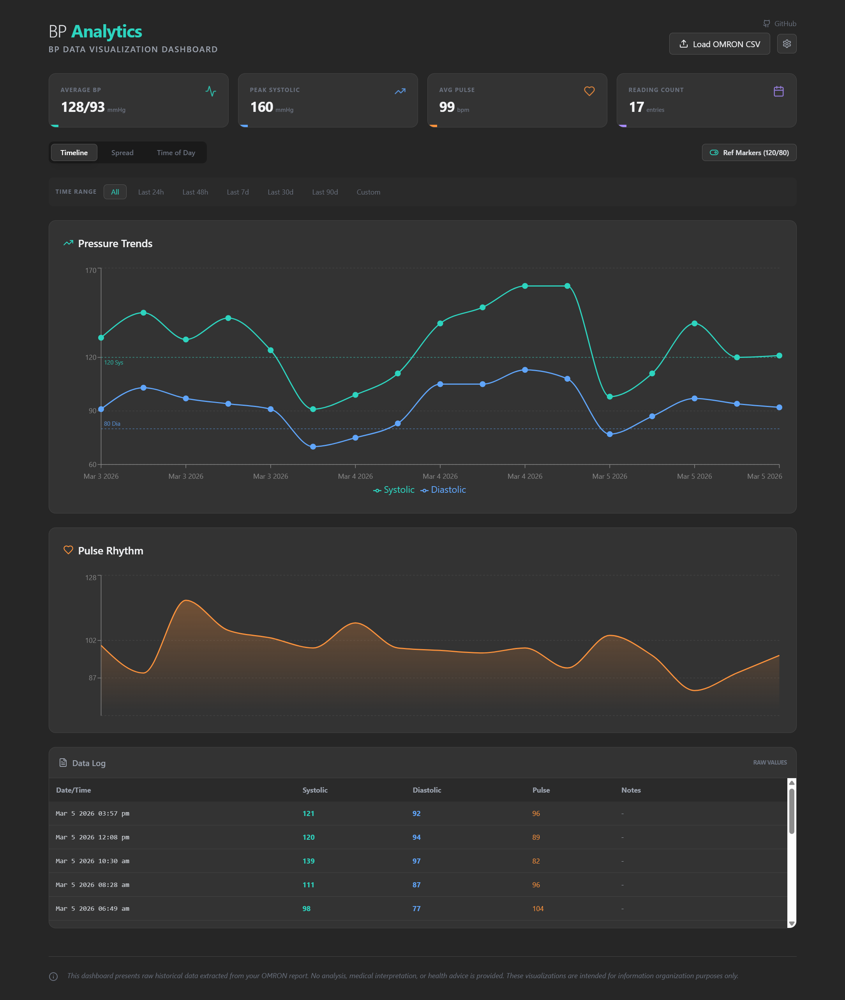

# BP Analytics — Omron Blood Pressure Visualizer

A dashboard for visualizing blood pressure data exported from Omron devices.



## Features

- Upload Omron CSV exports to visualize your blood pressure history
- View systolic/diastolic pressure trends and pulse rhythm over time
- Filter by time range (24h, 48h, 7d, 30d, 90d, or custom)
- Switch between timeline, spread, and time-of-day views
- Reference markers for normal blood pressure ranges
- Searchable data log with all readings

## Quick Start (Docker)

```yaml
services:
  vital-analytics:
    image: chvvkumar/omron-visualizer:latest
    ports:
      - "3000:3000"
    volumes:
      - vital-data:/app/data
    restart: unless-stopped

volumes:
  vital-data:
```

```bash
docker compose up -d
```

Open [http://localhost:3000](http://localhost:3000) in your browser.

## Usage

1. Export your blood pressure readings as a CSV file from the Omron app
2. Click **Load OMRON CSV** in the top-right corner of the dashboard
3. Upload your CSV file
4. Browse your data using the charts and filters

Your data is stored locally in a SQLite database and persists across container restarts via the `vital-data` volume.

## Running from Source

Requires Node.js 20+.

```bash
# Install dependencies
cd backend && npm install && cd ..
cd frontend && npm install && cd ..

# Start the backend (port 3001)
cd backend && npm start &

# Start the frontend (port 3000)
cd frontend && npm start
```

## Disclaimer

This dashboard is for informational and organizational purposes only. It does not provide medical analysis, interpretation, or health advice.
